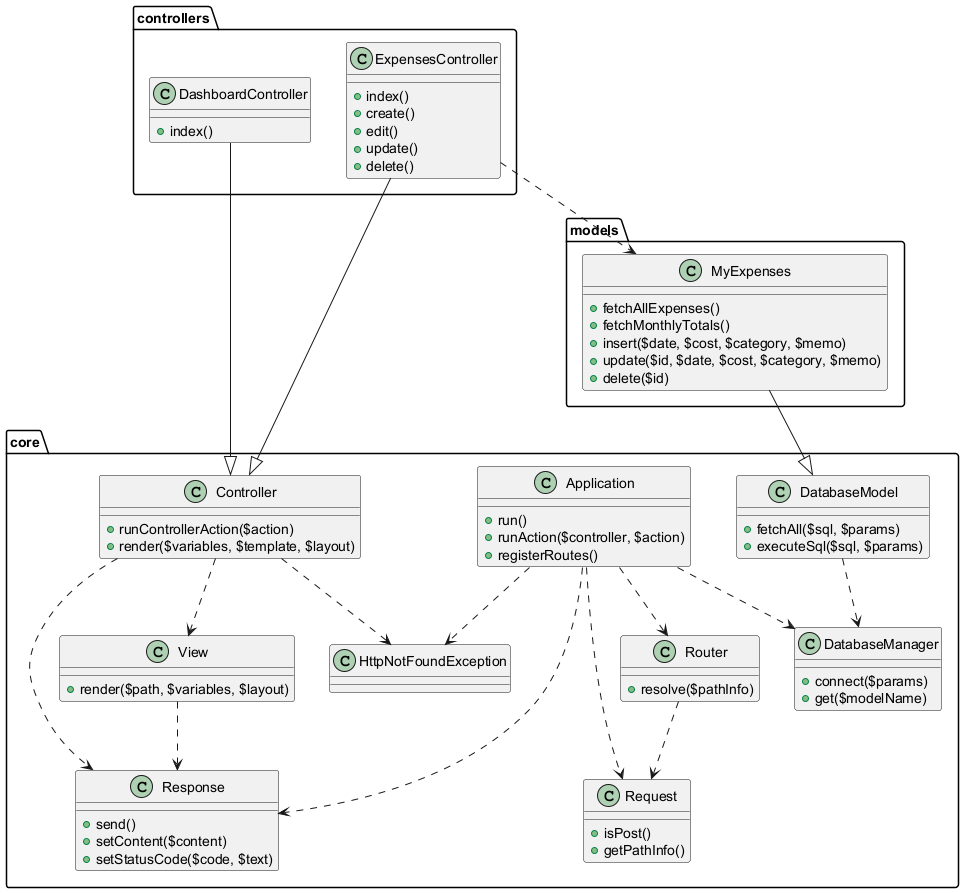
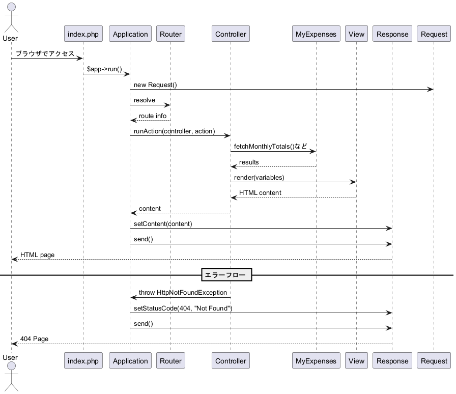
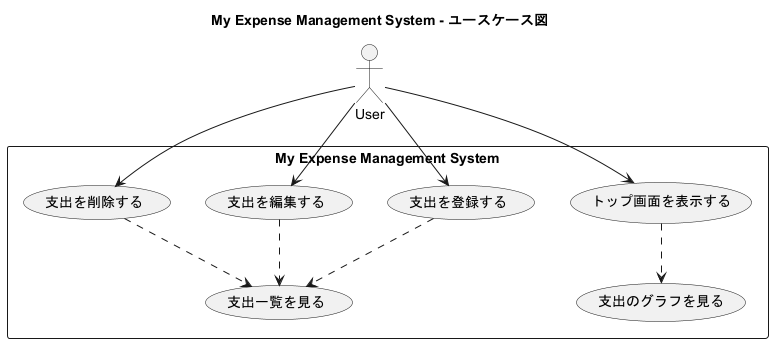

# My Expense Management System

個人の支出を管理するためのシンプルな MVC アプリケーションです。
PHP と PostgreSQL を使い、「独学エンジニア」というサイトの課題で勉強した MVC フレームワークの仕組みを使用して、
ポートフォリオ用の学習成果物として作成しました。

---

## 主な機能

* トップ画面（ダッシュボード）

  * 月ごとの支出合計をグラフで表示
* 支出一覧

  * 登録済みの支出を一覧で表示
* 支出登録

  * 日付、金額、カテゴリ、メモを入力して保存
* 支出編集

  * 既存データの更新
* 支出削除

  * 不要な支出の削除

---

## 構成

「独学エンジニア」というサイトの課題で勉強した MVC 構成で実装しています。

* `index.php` : エントリーポイント
* `src/core/` : フレームワークの基盤 (Application, Router, Controller, View, Database など)
* `src/controllers/` : 各機能ごとのコントローラ
* `src/models/` : DB アクセスを行うモデル
* `src/views/` : HTML テンプレート
* `public/css/` : スタイルシート

---

## UML ダイアグラム

### クラス図

（PlantUML で作成）



### シーケンス図



### ユースケース図



---

## 環境構築

### 前提

* Docker
* Docker Compose

### 手順

1. リポジトリをクローン

```bash
git clone https://github.com/yourname/my-expenses-app-mvc.git
cd my-expenses-app-mvc
```

2. コンテナを起動

```bash
docker compose up -d --build
```

3. アプリケーションコンテナに入る

```bash
docker compose exec app bash
```

---

## データベース初期化（Koyeb デモ用）

Koyeb などクラウド上でアプリをデプロイする場合、`psql` コマンドを直接実行できないことが多いため、PHP 内でテーブル作成を行う形にしています。

`DatabaseManager` クラスの `initDatabase()` メソッドを、アプリケーション起動時に自動で呼び出すようにしています：

```php
public function __construct() {
    $this->router = new Router($this->registerRoutes());
    $this->request = new Request();
    $this->response = new Response();
    $this->databaseManager = new DatabaseManager();

    $this->databaseManager->connect([
        'hostname' => getenv('DB_HOST'),
        'username' => getenv('DB_USER'),
        'password' => getenv('DB_PASSWORD'),
        'database' => getenv('DB_NAME'),
    ]);

    // データベース初期化（テーブルがなければ作成）
    $this->databaseManager->initDatabase();
}
```

これにより、デプロイ時に手動で SQL を実行する必要がなく、テーブルが存在しなければ自動で作成されます。

---

## サーバー起動

アプリケーションコンテナ内で以下を実行します。

```bash
php -S 0.0.0.0:8080 -t public
```

ブラウザでアクセス：

```
http://localhost:8080
```

---

## 今後の改善予定

* 入力フォームのバリデーション
* PHPUnit によるテストコード追加

---

## さいごに

本アプリケーションは学習を目的として作成したもので、まだまだ改善の余地があると感じています。
初心者ゆえに至らない点も多いかと思いますが、もしお気づきの点がございましたらご指摘いただけますと幸いです。
